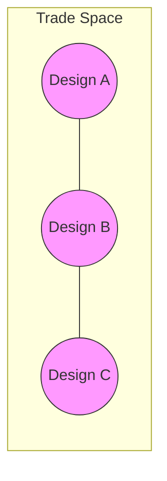

# Pareto Analysis

Pareto analysis identifies optimal trade-offs when multiple objectives conflict. A design is Pareto-optimal if no other design is better in all objectives.

## Pareto Optimality

### Concept

In multi-objective optimization, there's rarely a single "best" design. Instead, we find the **Pareto frontier** - the set of designs where improving one objective requires sacrificing another.



Design A is **Pareto-optimal** if there exists no other design that is:

- Better in at least one objective
- At least as good in all other objectives

### Example

Consider cost vs. performance:

| Design | Cost ($) | EIRP (dBW) | Pareto? |
|--------|----------|------------|---------|
| A | 20,000 | 42 | Yes |
| B | 30,000 | 48 | Yes |
| C | 25,000 | 44 | Yes |
| D | 35,000 | 46 | No (dominated by B) |
| E | 28,000 | 43 | No (dominated by C) |

Design D is dominated because B has better EIRP at similar cost.

## Extracting Pareto Frontier

### Basic Usage

```python
from phased_array_systems.trades import extract_pareto

# Define objectives: (metric_name, direction)
objectives = [
    ("cost_usd", "minimize"),
    ("eirp_dbw", "maximize"),
]

# Extract Pareto-optimal designs
pareto = extract_pareto(results, objectives)

print(f"Pareto-optimal: {len(pareto)} out of {len(results)}")
```

### Objective Directions

| Direction | Meaning |
|-----------|---------|
| `"minimize"` | Lower is better |
| `"maximize"` | Higher is better |

### Multiple Objectives

```python
# Three objectives
objectives = [
    ("cost_usd", "minimize"),
    ("eirp_dbw", "maximize"),
    ("prime_power_w", "minimize"),
]

pareto = extract_pareto(feasible, objectives)
```

### Including Dominated Points

To mark all points with Pareto status:

```python
all_results = extract_pareto(results, objectives, include_dominated=True)

# Results include 'pareto_optimal' column
pareto_mask = all_results["pareto_optimal"]
print(f"Pareto points: {pareto_mask.sum()}")
```

## Ranking Pareto Designs

Since all Pareto designs are optimal, ranking requires additional preferences.

### Weighted Sum

```python
from phased_array_systems.trades import rank_pareto

ranked = rank_pareto(
    pareto,
    objectives,
    weights=[0.5, 0.5],  # Equal weight
    method="weighted_sum",
)

# Results sorted by rank
print(ranked[["case_id", "cost_usd", "eirp_dbw", "pareto_rank"]].head())
```

Weight interpretation:

- Higher weight = more important
- Weights are normalized internally

### TOPSIS Method

Technique for Order of Preference by Similarity to Ideal Solution:

```python
ranked = rank_pareto(
    pareto,
    objectives,
    weights=[0.6, 0.4],
    method="topsis",
)
```

TOPSIS ranks based on distance to ideal and anti-ideal points.

### Custom Weights

Encode stakeholder preferences:

```python
# Cost-conscious: prioritize cost
ranked = rank_pareto(pareto, objectives, weights=[0.8, 0.2])

# Performance-focused: prioritize EIRP
ranked = rank_pareto(pareto, objectives, weights=[0.2, 0.8])
```

## Filtering Before Pareto

Always filter to feasible designs first:

```python
from phased_array_systems.trades import filter_feasible

# Filter feasible
feasible = filter_feasible(results, requirements)

# Then extract Pareto
pareto = extract_pareto(feasible, objectives)
```

If you include infeasible designs, they might appear Pareto-optimal (low cost but also low performance because requirements aren't met).

## Hypervolume Indicator

The hypervolume measures the quality of a Pareto front - larger is better.

```python
from phased_array_systems.trades import compute_hypervolume

hv = compute_hypervolume(pareto, objectives)
print(f"Hypervolume: {hv:.2e}")
```

Uses:

- Compare different DOE runs
- Track optimization progress
- Evaluate Pareto front quality

### Reference Point

The hypervolume is computed relative to a reference point:

```python
# Custom reference (worst acceptable values)
hv = compute_hypervolume(
    pareto,
    objectives,
    reference_point=[200000, -30],  # [max_cost, min_eirp]
)
```

Default: worst observed + 10%.

## Visualization

### Pareto Plot

```python
from phased_array_systems.viz import pareto_plot

fig = pareto_plot(
    results,
    x="cost_usd",
    y="eirp_dbw",
    pareto_front=pareto,
    feasible_mask=results["verification.passes"] == 1.0,
    color_by="link_margin_db",
    title="Cost vs EIRP Trade Space",
)
fig.savefig("pareto.png", dpi=150)
```

### 3D Trade Space

For three objectives:

```python
from phased_array_systems.viz import trade_space_plot

fig = trade_space_plot(
    results,
    x="cost_usd",
    y="eirp_dbw",
    z="prime_power_w",
    pareto_front=pareto,
)
```

## Complete Workflow

```python
"""Complete Pareto analysis workflow."""

from phased_array_systems.trades import (
    filter_feasible, extract_pareto, rank_pareto, compute_hypervolume
)
from phased_array_systems.viz import pareto_plot

# 1. Filter to feasible designs
feasible = filter_feasible(results, requirements)
print(f"Feasible: {len(feasible)}/{len(results)}")

# 2. Define objectives
objectives = [
    ("cost_usd", "minimize"),
    ("eirp_dbw", "maximize"),
]

# 3. Extract Pareto frontier
pareto = extract_pareto(feasible, objectives)
print(f"Pareto-optimal: {len(pareto)}")

# 4. Compute hypervolume
hv = compute_hypervolume(pareto, objectives)
print(f"Hypervolume: {hv:.2e}")

# 5. Rank with different preference scenarios
scenarios = [
    ("Cost-focused", [0.8, 0.2]),
    ("Balanced", [0.5, 0.5]),
    ("Performance-focused", [0.2, 0.8]),
]

for name, weights in scenarios:
    ranked = rank_pareto(pareto, objectives, weights=weights)
    best = ranked.iloc[0]
    print(f"\n{name}: {best['case_id']}")
    print(f"  Cost: ${best['cost_usd']:,.0f}")
    print(f"  EIRP: {best['eirp_dbw']:.1f} dBW")

# 6. Visualize
fig = pareto_plot(
    results,
    x="cost_usd",
    y="eirp_dbw",
    pareto_front=pareto,
    feasible_mask=results["verification.passes"] == 1.0,
)
```

## Advanced Topics

### Knee Point Detection

Find the "knee" of the Pareto front - the design with best trade-off:

```python
import numpy as np

# Normalize objectives
cost_norm = (pareto["cost_usd"] - pareto["cost_usd"].min()) / (
    pareto["cost_usd"].max() - pareto["cost_usd"].min()
)
eirp_norm = (pareto["eirp_dbw"].max() - pareto["eirp_dbw"]) / (
    pareto["eirp_dbw"].max() - pareto["eirp_dbw"].min()
)

# Distance from ideal (0,0)
distance = np.sqrt(cost_norm**2 + eirp_norm**2)
knee_idx = distance.argmin()
knee_design = pareto.iloc[knee_idx]
print(f"Knee point: {knee_design['case_id']}")
```

### Epsilon-Dominance

Relaxed dominance for diverse Pareto front:

```python
def epsilon_dominates(a, b, objectives, epsilon=0.01):
    """Check if design a epsilon-dominates design b."""
    for metric, direction in objectives:
        a_val, b_val = a[metric], b[metric]
        if direction == "minimize":
            if a_val > b_val * (1 + epsilon):
                return False
        else:
            if a_val < b_val * (1 - epsilon):
                return False
    return True
```

### Progressive Pareto

Track Pareto front evolution during adaptive sampling:

```python
fronts = []
for n_samples in [20, 50, 100, 200]:
    doe = generate_doe(space, n_samples=n_samples, seed=42)
    results = runner.run(doe)
    feasible = filter_feasible(results, requirements)
    pareto = extract_pareto(feasible, objectives)
    hv = compute_hypervolume(pareto, objectives)
    fronts.append({"n_samples": n_samples, "n_pareto": len(pareto), "hv": hv})

print(pd.DataFrame(fronts))
```

## Best Practices

### 1. Always Filter First

```python
# Good: filter then Pareto
feasible = filter_feasible(results, requirements)
pareto = extract_pareto(feasible, objectives)

# Bad: Pareto on raw results (includes infeasible)
pareto = extract_pareto(results, objectives)  # Don't do this!
```

### 2. Choose Objectives Carefully

- Include objectives that conflict
- Avoid redundant objectives
- Consider 2-3 key objectives

### 3. Document Weights

```python
# Document decision rationale
weights = {
    "cost_usd": 0.4,      # Budget-constrained
    "eirp_dbw": 0.4,      # Performance critical
    "prime_power_w": 0.2,  # Power is secondary
}
```

### 4. Present Multiple Scenarios

Show how rankings change with different preferences:

```python
for scenario_name, scenario_weights in preference_scenarios.items():
    ranked = rank_pareto(pareto, objectives, weights=list(scenario_weights.values()))
    print(f"\n{scenario_name}: Top 3")
    for _, row in ranked.head(3).iterrows():
        print(f"  {row['case_id']}")
```

## See Also

- [Trade Studies](trade-studies.md) - DOE and batch evaluation
- [Visualization](visualization.md) - Plotting functions
- [Theory: Pareto Optimization](../theory/pareto-optimization.md) - Mathematical background
- [API Reference](../api/trades.md) - Full API documentation
