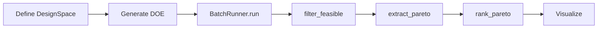

# Trade Studies

Trade studies enable systematic exploration of design alternatives using Design of Experiments (DOE) and batch evaluation.

## Overview

The trade study workflow:



## Design Space

A `DesignSpace` defines which parameters can vary and their bounds.

### Creating a Design Space

```python
from phased_array_systems.trades import DesignSpace

space = DesignSpace(name="My Trade Study")

# Add variables using fluent interface
space = (
    DesignSpace(name="Array Trade Study")
    .add_variable("array.nx", type="int", low=4, high=16)
    .add_variable("array.ny", type="int", low=4, high=16)
    .add_variable("rf.tx_power_w_per_elem", type="float", low=0.5, high=3.0)
    .add_variable("array.geometry", type="categorical", values=["rectangular"])
)
```

### Variable Types

| Type | Parameters | Description |
|------|------------|-------------|
| `int` | `low`, `high` | Discrete integers |
| `float` | `low`, `high` | Continuous values |
| `categorical` | `values` | Enumerated options |

### Fixed Parameters

Set `low=high` to fix a parameter:

```python
space.add_variable("array.dx_lambda", type="float", low=0.5, high=0.5)  # Fixed at 0.5
```

Or use categorical with single value:

```python
space.add_variable("array.geometry", type="categorical", values=["rectangular"])
```

### Complete Design Space Example

```python
space = (
    DesignSpace(name="Comms Array Trade")
    # Variable parameters
    .add_variable("array.nx", type="categorical", values=[4, 8, 16])
    .add_variable("array.ny", type="categorical", values=[4, 8, 16])
    .add_variable("rf.tx_power_w_per_elem", type="float", low=0.5, high=3.0)
    .add_variable("rf.pa_efficiency", type="float", low=0.2, high=0.5)
    .add_variable("cost.cost_per_elem_usd", type="float", low=75.0, high=150.0)
    # Fixed parameters
    .add_variable("array.geometry", type="categorical", values=["rectangular"])
    .add_variable("array.dx_lambda", type="float", low=0.5, high=0.5)
    .add_variable("array.dy_lambda", type="float", low=0.5, high=0.5)
    .add_variable("array.enforce_subarray_constraint", type="categorical", values=[True])
    .add_variable("rf.noise_figure_db", type="float", low=3.0, high=3.0)
    .add_variable("rf.feed_loss_db", type="float", low=1.0, high=1.0)
    .add_variable("cost.nre_usd", type="float", low=10000.0, high=10000.0)
)

print(f"Design space: {space.n_dims} dimensions")
```

## DOE Generation

Generate cases using various sampling methods.

### Sampling Methods

| Method | Description | Best For |
|--------|-------------|----------|
| `lhs` | Latin Hypercube Sampling | General exploration, space-filling |
| `random` | Uniform random | Quick exploration |
| `grid` | Full factorial | Small design spaces, complete coverage |

### Latin Hypercube Sampling (LHS)

Default and recommended for most studies:

```python
from phased_array_systems.trades import generate_doe

doe = generate_doe(
    space,
    method="lhs",
    n_samples=100,
    seed=42,  # For reproducibility
)

print(f"Generated {len(doe)} cases")
print(doe.head())
```

LHS properties:

- Space-filling: samples spread across all dimensions
- Efficient: good coverage with fewer samples than grid
- Reproducible with seed

### Random Sampling

```python
doe = generate_doe(space, method="random", n_samples=100, seed=42)
```

### Grid Sampling

Full factorial grid (use with small design spaces):

```python
# Grid with default levels
doe = generate_doe(space, method="grid")

# Grid with custom levels
doe = generate_doe(space, method="grid", grid_levels=5)
```

!!! warning "Grid Size"
    Grid size grows exponentially: 5 variables × 5 levels = 3,125 cases.

### Quick DOE from Dictionary

For simple cases:

```python
from phased_array_systems.trades import generate_doe_from_dict

doe = generate_doe_from_dict(
    {
        "array.nx": (4, 16, "int"),
        "array.ny": (4, 16, "int"),
        "rf.tx_power_w_per_elem": (0.5, 3.0),  # float implied
        "array.geometry": ["rectangular", "triangular"],  # categorical
    },
    n_samples=50,
    seed=42,
)
```

## Batch Evaluation

Run all DOE cases with `BatchRunner`.

### Basic Usage

```python
from phased_array_systems.trades import BatchRunner

runner = BatchRunner(scenario)
results = runner.run(doe)

print(f"Completed {len(results)} cases")
print(f"Columns: {list(results.columns)}")
```

### With Requirements

```python
from phased_array_systems.requirements import RequirementSet

runner = BatchRunner(scenario, requirements)
results = runner.run(doe)

# Results include verification columns
print(f"Feasible: {(results['verification.passes'] == 1.0).sum()}")
```

### Progress Callback

```python
def progress(completed, total):
    pct = completed / total * 100
    if completed % 10 == 0:
        print(f"Progress: {completed}/{total} ({pct:.0f}%)")

results = runner.run(doe, progress_callback=progress)
```

### Parallel Evaluation

```python
# Use multiple workers
results = runner.run(doe, n_workers=4)
```

!!! note "Worker Count"
    Set `n_workers` based on CPU cores. Default is 1 (sequential).

### Results DataFrame

The results DataFrame includes:

| Category | Example Columns |
|----------|-----------------|
| Case ID | `case_id` |
| Architecture | `array.nx`, `array.ny`, `rf.tx_power_w_per_elem` |
| Performance | `eirp_dbw`, `link_margin_db`, `cost_usd` |
| Verification | `verification.passes`, `verification.must_pass_count` |
| Metadata | `meta.runtime_s`, `meta.error` |

## Filtering Results

### Filter Feasible

```python
from phased_array_systems.trades import filter_feasible

# Using requirements
feasible = filter_feasible(results, requirements)

# Using verification column
feasible = filter_feasible(results)  # Uses verification.passes column
```

### Manual Filtering

```python
# Filter by specific criteria
good_designs = results[
    (results["link_margin_db"] > 3.0) &
    (results["cost_usd"] < 50000)
]
```

## Augmenting DOE

Add more samples to an existing study:

```python
from phased_array_systems.trades import augment_doe

# Add 50 more samples
expanded_doe = augment_doe(
    existing_doe=doe,
    design_space=space,
    n_additional=50,
    method="lhs",
    seed=43,  # Different seed
)

# Run new cases only
new_cases = expanded_doe[~expanded_doe["case_id"].isin(doe["case_id"])]
new_results = runner.run(new_cases)

# Combine results
all_results = pd.concat([results, new_results], ignore_index=True)
```

## Case IDs

Each case gets a unique ID for tracking:

```python
print(doe["case_id"].head())
# case_00000
# case_00001
# case_00002
# ...
```

IDs are stable with the same seed, enabling reproducibility.

## Error Handling

Batch evaluation handles errors gracefully:

```python
# Check for errors
errors = results[results["meta.error"].notna()]
print(f"Cases with errors: {len(errors)}")

# View error messages
for _, row in errors.iterrows():
    print(f"{row['case_id']}: {row['meta.error']}")
```

Errors don't stop the batch - other cases continue.

## Exporting Results

```python
from phased_array_systems.io import export_results

# Parquet (recommended for large datasets)
export_results(results, "results.parquet")

# CSV
export_results(results, "results.csv", format="csv")
```

## Complete Example

```python
"""Complete trade study workflow."""

from phased_array_systems.scenarios import CommsLinkScenario
from phased_array_systems.requirements import Requirement, RequirementSet
from phased_array_systems.trades import (
    DesignSpace, generate_doe, BatchRunner,
    filter_feasible, extract_pareto, rank_pareto,
)
from phased_array_systems.viz import pareto_plot
from phased_array_systems.io import export_results

# 1. Define scenario
scenario = CommsLinkScenario(
    freq_hz=10e9,
    bandwidth_hz=10e6,
    range_m=100e3,
    required_snr_db=10.0,
)

# 2. Define requirements
requirements = RequirementSet(requirements=[
    Requirement("REQ-001", "Min EIRP", "eirp_dbw", ">=", 35.0, severity="must"),
    Requirement("REQ-002", "Positive Margin", "link_margin_db", ">=", 0.0, severity="must"),
    Requirement("REQ-003", "Max Cost", "cost_usd", "<=", 100000.0, severity="must"),
])

# 3. Define design space
space = (
    DesignSpace(name="Comms Trade")
    .add_variable("array.nx", type="categorical", values=[4, 8, 16])
    .add_variable("array.ny", type="categorical", values=[4, 8, 16])
    .add_variable("rf.tx_power_w_per_elem", type="float", low=0.5, high=3.0)
    .add_variable("cost.cost_per_elem_usd", type="float", low=75.0, high=150.0)
    # Fixed parameters...
    .add_variable("array.geometry", type="categorical", values=["rectangular"])
    .add_variable("array.dx_lambda", type="float", low=0.5, high=0.5)
    .add_variable("array.dy_lambda", type="float", low=0.5, high=0.5)
    .add_variable("array.enforce_subarray_constraint", type="categorical", values=[True])
    .add_variable("rf.pa_efficiency", type="float", low=0.3, high=0.3)
    .add_variable("rf.noise_figure_db", type="float", low=3.0, high=3.0)
    .add_variable("cost.nre_usd", type="float", low=10000.0, high=10000.0)
)

# 4. Generate DOE
doe = generate_doe(space, method="lhs", n_samples=100, seed=42)
print(f"Generated {len(doe)} cases")

# 5. Run batch evaluation
runner = BatchRunner(scenario, requirements)
results = runner.run(doe, n_workers=1)
print(f"Completed {len(results)} cases")

# 6. Filter feasible
feasible = filter_feasible(results, requirements)
print(f"Feasible: {len(feasible)} ({len(feasible)/len(results)*100:.1f}%)")

# 7. Extract Pareto frontier
pareto = extract_pareto(feasible, [
    ("cost_usd", "minimize"),
    ("eirp_dbw", "maximize"),
])
print(f"Pareto-optimal: {len(pareto)}")

# 8. Rank Pareto designs
ranked = rank_pareto(pareto, [
    ("cost_usd", "minimize"),
    ("eirp_dbw", "maximize"),
], weights=[0.5, 0.5])

# 9. Show top designs
print("\nTop 5 designs:")
for _, row in ranked.head(5).iterrows():
    print(f"  {row['case_id']}: ${row['cost_usd']:,.0f}, {row['eirp_dbw']:.1f} dBW")

# 10. Visualize
fig = pareto_plot(
    results,
    x="cost_usd",
    y="eirp_dbw",
    pareto_front=pareto,
    feasible_mask=results["verification.passes"] == 1.0,
)
fig.savefig("pareto.png", dpi=150)

# 11. Export
export_results(results, "results.parquet")
export_results(ranked, "pareto.csv", format="csv")
```

## See Also

- [Pareto Analysis](pareto-analysis.md) - Multi-objective optimization
- [Visualization](visualization.md) - Plotting trade-offs
- [API Reference](../api/trades.md) - Full API documentation
